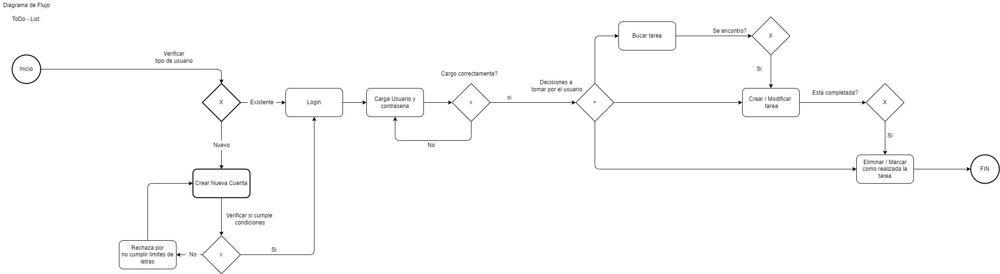

# Invera ToDo-List Challenge (Python/Django Jr-SSr)

El propósito de esta prueba es conocer tu capacidad para crear una pequeña aplicación funcional en un límite de tiempo. A continuación, encontrarás las funciones, los requisitos y los puntos clave que debés tener en cuenta durante el desarrollo.

## Qué queremos que hagas:

- El Challenge consiste en crear una aplicación web sencilla que permita a los usuarios crear y mantener una lista de tareas.
- La entrega del resultado será en un nuevo fork de este repo y deberás hacer una pequeña demo del funcionamiento y desarrollo del proyecto ante un super comité de las más grandes mentes maestras de Invera, o a un par de devs, lo que sea más fácil de conseguir.
- Podes contactarnos en caso que tengas alguna consulta.

## Objetivos:

El usuario de la aplicación tiene que ser capaz de:

- Autenticarse
- Crear una tarea
- Eliminar una tarea
- Marcar tareas como completadas
- Poder ver una lista de todas las tareas existentes
- Filtrar/buscar tareas por fecha de creación y/o por el contenido de la misma

## Qué evaluamos:

- Desarrollo utilizando Python, Django. No es necesario crear un Front-End, pero sí es necesario tener una API que permita cumplir con los objetivos de arriba.
- Uso de librerías y paquetes estandares que reduzcan la cantidad de código propio añadido.
- Calidad y arquitectura de código. Facilidad de lectura y mantenimiento del código. Estándares seguidos.
- [Bonus] Manejo de logs.
- [Bonus] Creación de tests (unitarias y de integración)
- [Bonus] Unificar la solución propuesta en una imagen de Docker por repositorio para poder ser ejecutada en cualquier ambiente (si aplica para full stack).

## Requerimientos de entrega:

- Hacer un fork del proyecto y pushearlo en github. Puede ser privado.
- La solución debe correr correctamente.
- El Readme debe contener todas las instrucciones para poder levantar la aplicación, en caso de ser necesario, y explicar cómo se usa.
- Disponibilidad para realizar una pequeña demo del proyecto al finalizar el challenge.
- Tiempo para la entrega: Aproximadamente 7 días.


-------------------------------------------------------------------------------------------------------------------------------------------------


# Resolución del Challenge

En esta versión actualizada del repositorio, he implementado una solución mejorada para el challenge. La principal mejora radica en la organización del código y la separación de la resolución antigua de la nueva mediante la creación de carpetas específicas.

## Instrucciones de Uso

Para obtener este repositorio, ejecute el siguiente comando dentro de su terminal habilitada para git
```bash
$ git clone 
```

Luego de clonarlo, puedes instalar las dependencias de Django con el siguiente comando:

```bash
$ pip install -r requirements.txt
```


Para explorar la nueva resolución, ejecuta el siguiente comando en tu terminal:
```bash
$ cd new-todo-list
```

Para comparar la versión anterior del challenge con la nueva, puedes acceder a la resolución anterior mediante el siguiente comando:
```bash
cd old-todo-list
```

Cada carpeta contiene su propio README con las instrucciones de uso.

## Descripción del Challenge

El desafío consistió en desarrollar una aplicación web sencilla que permita a los usuarios crear y gestionar una lista de tareas. Además, se requería funcionalidades como autenticación, eliminación de tareas, marcado de tareas como completadas, visualización de todas las tareas existentes y la capacidad de filtrar/buscar tareas por su contenido.

Aunque no era obligatorio crear un frontend, decidí implementarlo para mejorar la experiencia del usuario.


## Diagrama de Flujo

Se ha creado un diagrama de flujo para visualizar de manera clara los procesos involucrados en la aplicación y cómo se relacionan entre sí. Este diagrama proporciona una visión general de la lógica de la aplicación y facilita la comprensión de su funcionamiento.




¡Gracias por revisar la resolución mejorada del challenge! Si tienes alguna pregunta o sugerencia, no dudes en comunicarte.